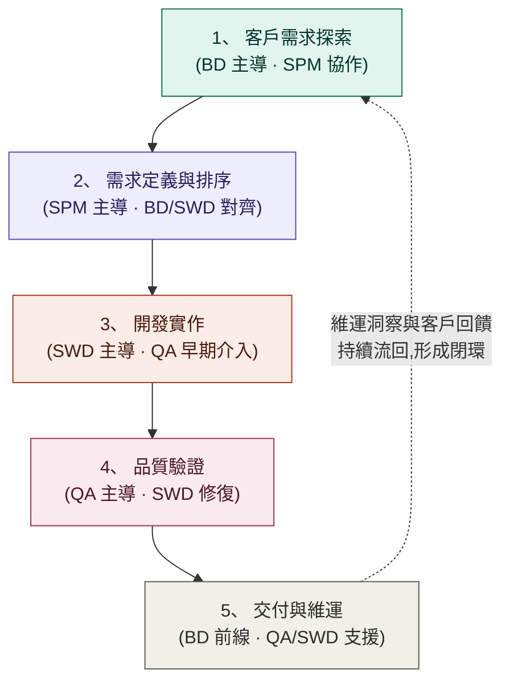

# AI 時代產品開發全流程 Workflow 架構

> 設計理念:**AI 做初稿與加速,人做決策與對齊。**
> AI 負責高頻重複工作(初稿、分析、驗證),人負責判斷、取捨與跨部門對齊。

---

## 一、核心流程圖

---

## 二、四部門 Role & Responsibility

| 部門 | 主導職責 (Accountable) | 協作職責 (Consulted / Support) | AI Contributor 的用法 |
|------|------|------|------|
| **BD** | 客戶關係、需求探索、商務承諾、交付後的客戶滿意度 | 參與需求排序、提供市場與競品情報 | AI 整理會議紀錄、生成客戶提案初稿、分析客戶回饋情緒與趨勢 |
| **SPM** | 需求轉譯為 PRD / User Story、優先級排序、進度與里程碑管理 | 協助 BD 評估需求可行性、協助 SWD 釐清規格 | AI 將客戶原始需求轉為結構化 PRD、自動生成進度週報、識別跨需求的衝突與依賴 |
| **SWD** | 技術方案設計、開發實作、技術債管理 | 早期參與需求評估(給出可行性與工時)、支援維運除錯 | AI 輔助寫碼與 Code Review、生成技術文件、快速做 PoC 驗證方案 |
| **QA** | 測試策略、品質把關、發布准入(Go/No-Go 品質面) | 從需求階段介入定義驗收標準、維運期監控品質指標 | AI 從 PRD 自動生成測試案例、自動化回歸測試、分析缺陷模式找出高風險模組 |

---

## 三、三個關鍵協作機制(人類默契的部分)

AI 能加速產出,但以下三個「人對人」節點必須保留,是流程有效的關鍵:

### 1. 需求對齊會(BD + SPM + SWD,每個新需求進入時)
- BD 帶客戶原始語言、SPM 帶 AI 生成的 PRD 初稿、SWD 帶可行性判斷。
- 三方一次對齊「客戶要什麼」「我們做什麼」「做得到嗎」,避免傳話失真。
- AI 產出的 PRD 只是討論起點,不是結論。

### 2. 品質左移(QA 在第 2 階段就介入)
- QA 在 SPM 定義需求時,即用 AI 生成驗收標準草稿,與 SWD 確認「什麼叫做完成」。
- SWD 開發時,AI 生成的測試案例可同步執行,讓缺陷在最便宜的階段被抓到。

### 3. 維運回饋迴圈(BD + QA 共管,每月回顧)
- BD 收集客戶聲音、QA 收集線上品質數據,雙方用 AI 彙整成洞察報告。
- 洞察回饋給 SPM 排入下一輪需求,讓流程從「線」變成「環」。

---

## 四、AI 與人的分工原則

> **AI 負責 3D:Draft、Data、Detect**(初稿、數據整理、異常偵測)
> **人負責 3 個關鍵:Decide、Align、Own**(決策、對齊、當責)

每個階段的產出物由 AI 先完成 70 分初稿,由該階段的主導部門審核、修正並簽核至 100 分。
**簽核者即當責者 —— 這一點不因使用 AI 而改變。**
